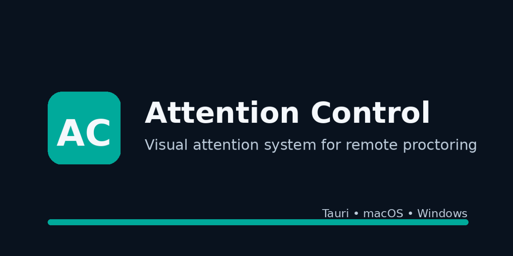
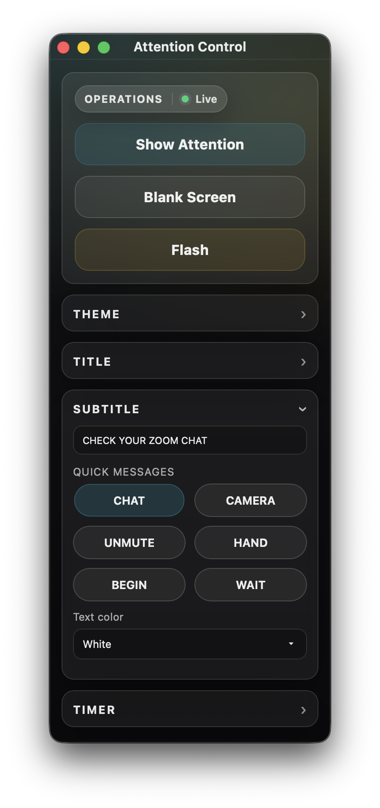
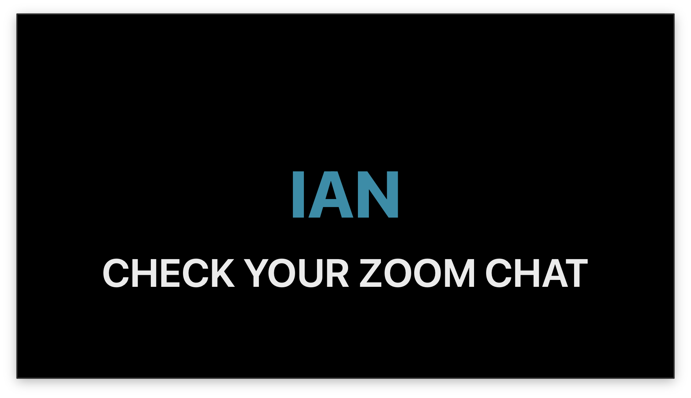

# Attention Control

<p align="center">
  
</p>

<p align="center">
  <strong>A lightweight visual attention system for remote proctoring</strong><br>
  Clear, high-contrast signals to regain attention when audio isn’t enough.
</p>

<p align="center">
  
  
  
  
</p>

---

## ✨ Overview

**Attention Control** is a two‑window visual overlay system for remote exams and proctored sessions.

It enables a proctor to display large, unmistakable visual messages to students via screen sharing — ensuring critical instructions are seen even if audio is muted, missed, or ignored.

Designed for real‑time use under pressure, the app emphasizes:

- 🚨 Immediate visibility
- ⚡ Fast operation
- 🧠 Minimal cognitive load
- ♿ Accessibility
- 🔒 Non‑intrusive communication
- 🧪 Reliability during live testing

---

## 🧭 How It Works

Attention Control uses two coordinated windows.

### 🖥 Student View (Shared)

This is the window you share with students (e.g., via Zoom screen share).  
It contains **no controls or clutter**, only clear visual cues.

**Modes**

- **Message (default)** — Large title + subtitle
- **Blank** — Solid screen to pause activity
- **Flash** — Brief visual pulse to regain attention

**Key Characteristics**

- Fullscreen friendly  
- Safe margins for screen sharing  
- Readable on small laptops  
- Minimal UI  
- Optimized for distance viewing  

---

### 🎛 Proctor Control (Private)

This is the control panel used by the proctor.  
It sends commands to the Student View in real time.

#### 🟢 Operations

Immediate attention controls:

- **Show Attention** — Display message screen
- **Blank Screen** — Temporarily block view
- **Flash** — Short visual pulse

#### ✏️ Content

Customize what students see:

- Title text
- Subtitle text
- Quick preset messages
- Color selection

#### 🎨 Appearance

Adjust visual styling:

- Background color
- Text color
- Contrast options

#### ⏱ Timer

Optional countdown tools:

- Start / Pause / Reset
- Configurable duration
- Hidden when not in use

---

## 🖼 Screenshots

### Proctor Control Panel



### Student View — Message Mode



### Student View — Blank Mode


---

## 📦 Installation

### Prebuilt Releases

Download the latest version from the Releases page:

👉 https://github.com/your-username/attention-control/releases

#### macOS

1. Download the `.dmg`
2. Move to **Applications**
3. Open (allow in Security settings if prompted)

#### Windows

1. Download the `.msi` or `.exe`
2. Run the installer
3. Launch the app

---

### 🛠 Build From Source

#### Requirements

- Node.js (v18+ recommended)
- Rust (stable toolchain)
- Tauri prerequisites

Install Rust:

https://rustup.rs/

Install Tauri CLI:

```bash
npm install -g @tauri-apps/cli
```

#### Clone and run

```bash
git clone https://github.com/your-username/attention-control.git
cd attention-control
npm install
npm run tauri dev
```

#### Build production version

```bash
npm run tauri build
```

---

## 🚀 Usage

1. Launch Attention Control
2. Open the **Student View**
3. Share the Student View window via Zoom (or similar)
4. Use the Proctor Control panel to send visual signals

Typical workflow:

- Show Attention → Display instructions
- Blank Screen → Pause activity
- Flash → Quickly regain focus

---

## 🛡 Safety & Design Principles

Attention Control is strictly a communication tool.

It does **not**:

- Monitor students
- Record activity
- Access cameras or microphones
- Collect personal data

Flash behavior is designed to avoid aggressive strobe effects and may include safeguards such as cooldowns or reduced‑motion patterns.

---

## 🎓 Typical Use Cases

- Remote proctored exams
- Virtual testing centers
- Online classrooms
- Situations where audio alerts may not be heard

---

## 🧑‍💻 Development

Built with:

- Tauri
- Vanilla TypeScript
- HTML/CSS

The architecture is intentionally simple to maximize reliability during live sessions.

---

## 🗺 Roadmap

Planned enhancements:

- Preset message packs
- High‑contrast accessibility mode
- Action sequences (Flash → Message → Flash)
- Event logging
- Keyboard shortcuts
- Timer automation

---

## 📄 License

MIT License — see LICENSE file for details.

---

## ⚠️ Disclaimer

Attention Control is a communication tool only.  
It does not enforce academic integrity policies or monitor behavior.

Institutions should ensure compliance with local regulations and accessibility requirements before deployment.
